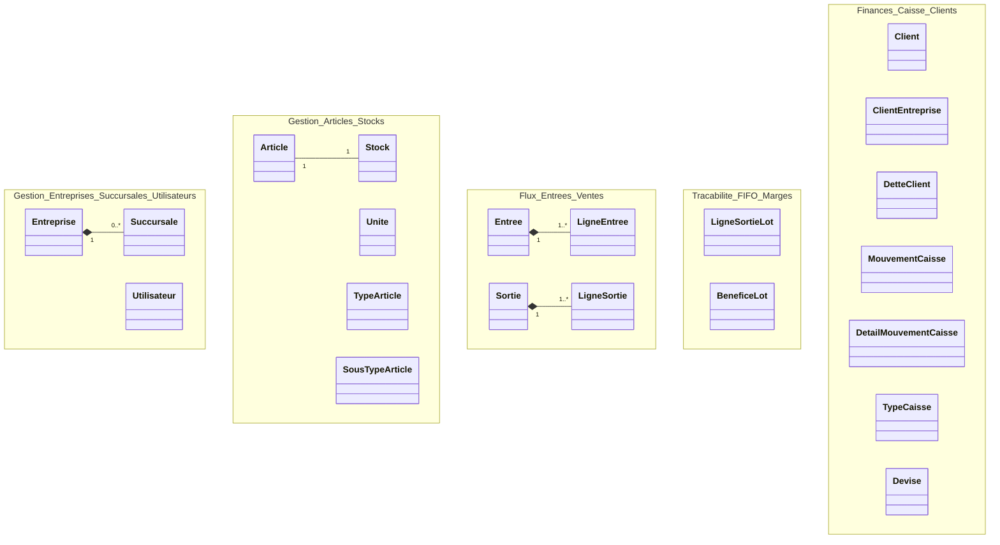

# Modèle de classes UHAKIKAAPP (Mermaid)

## Comment afficher le diagramme (important)

Sur [mermaid.live](https://mermaid.live), **ne collez pas ce fichier Markdown**.

1. Ouvrez **`docs/modele-classes.mmd`**
2. Copiez **tout** son contenu (la première ligne doit être `classDiagram`)
3. Collez dans l’éditeur mermaid.live

**Ne pas coller :**
- le titre `# Modèle de classes...`
- les lignes ` ```mermaid ` / ` ``` `
- le tableau Django en bas de ce fichier

---

## Fichier source du diagramme

**Code Mermaid pur :** [`modele-classes.mmd`](modele-classes.mmd)

---

## Aperçu (GitHub / VS Code)

Si votre lecteur Markdown supporte Mermaid, le bloc ci-dessous s’affiche directement ici :



> Le diagramme complet (attributs + toutes les relations) est dans **`modele-classes.mmd`**.

---

## Correspondance avec le code Django

| Classe diagramme | Fichier modèle |
|------------------|----------------|
| Entreprise, Succursale, Article, Stock, Entree, Sortie, Client, DetteClient, MouvementCaisse, Devise, … | `stock/models.py` |
| Utilisateur | `users/models.py` (`User`) |
| LigneSortieLot, BeneficeLot | `stock/models.py` |
| Lot, Fournisseur (non représentés ici) | `order/models.py` |
| InventaireSession, InventaireLigne | `stock/models.py` |
